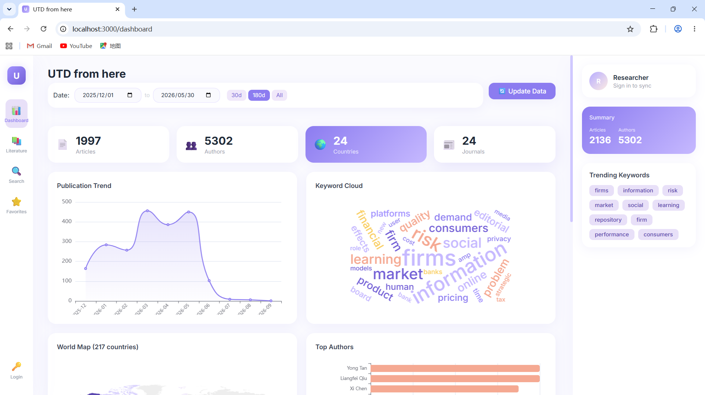
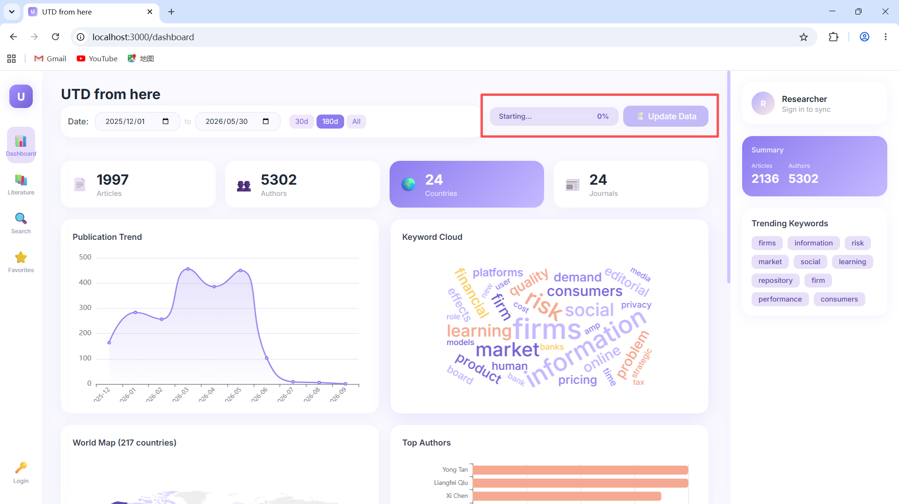
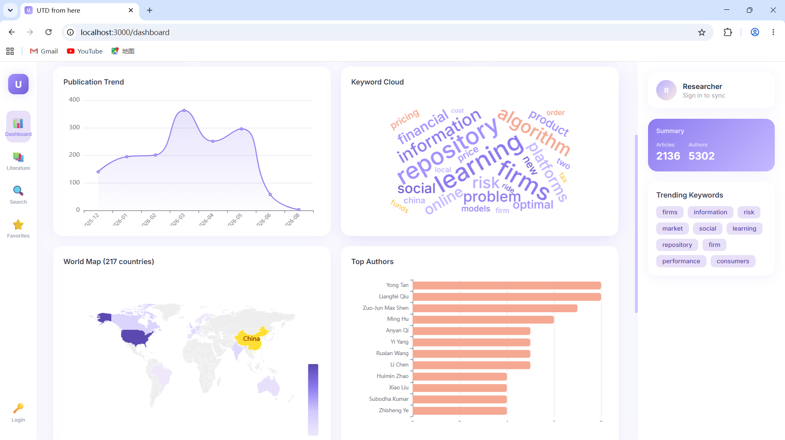
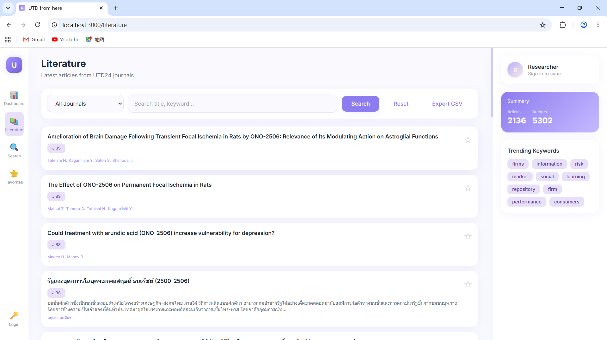
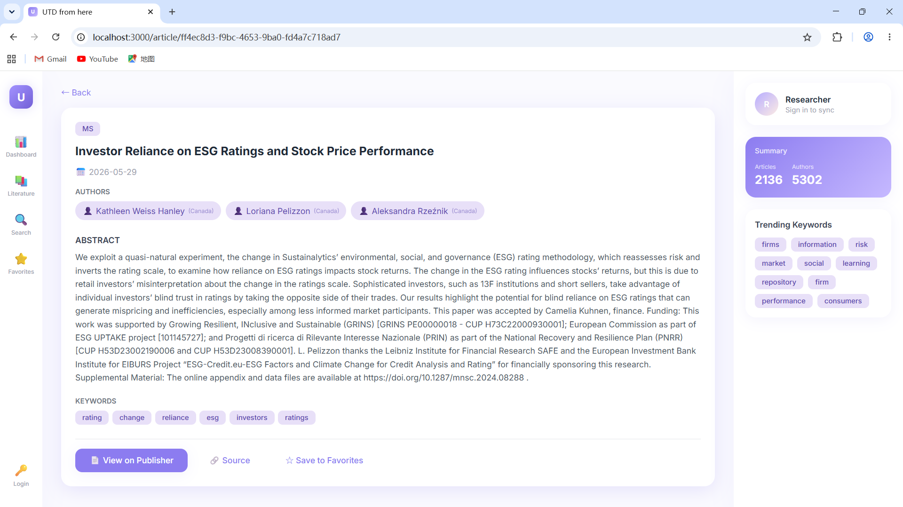
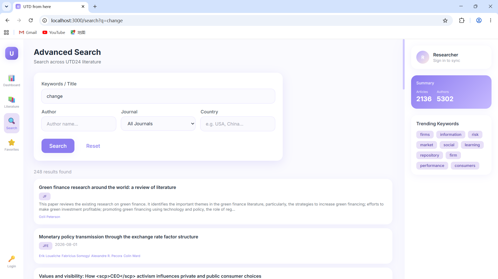
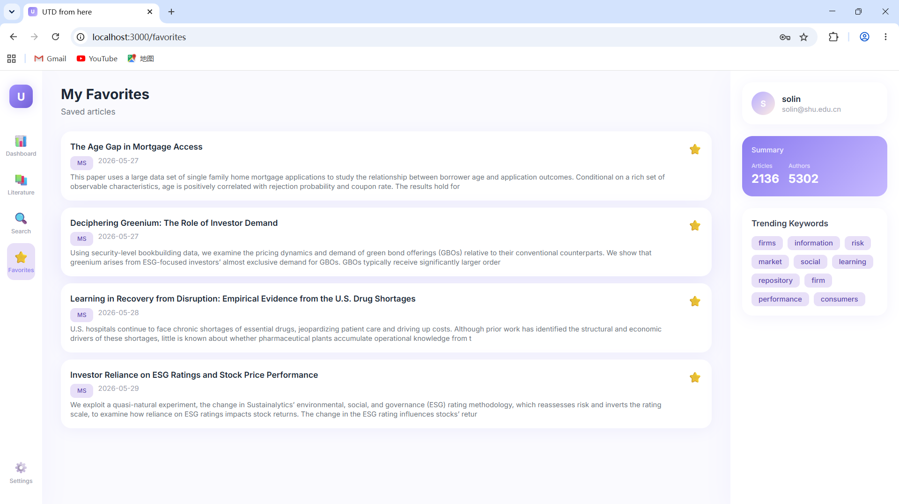

<div align="center">


<h3> UTD24 from here · UTD24 Visualization platform <h3>

[简体中文](./README_Cn.md) | [English](./README.md)

*“Broad observation, frugal adoption; deep accumulation, slow expression.”一一Su Shi, a Chinese poet*

</div>
  
 **UTD24 is a top-ranked journal list in the field of economics and management, documenting the greatest and most cutting-edge academic achievements in the field of economics and management, and laying the foundation for the entire academic edifice of economics and management. However, when reading, it is very cumbersome to switch between various journal search pages. To facilitate everyone's better exploration and absorption of the latest achievements in these 24 academic journals, UTD24-from-here can automatically collect the data of these 24 journals and convert the original literature into interactive visual dashboards: author distribution map, keyword word cloud, publication trend chart, author collaboration network, all available, making it convenient for learners to obtain thinking through the visualization of literature data.**


## 📄 Project brief
* **UTD24 Introduction**: UTD24, officially known as The University of Texas at Dallas 24 Journals, is a journal database established by the Naveen Jain School of Management at the University of Texas at Dallas. It includes 24 top business and management journals and is used for conducting research rankings of the top 100 business schools worldwide.
* **Data Sources**: Accesses three major data sources: CrossRef, Semantic Scholar, and OpenAlex
* **Visualization**: Automatically crawls, duplicates remove, stores all journal metadata, provides multiple interactive BI charts, supports drilling down and date filtering
* **One-click Update**: Updates data in one click, ensuring the literature library remains always up-to-date


## Page Display 




 



## 🚀 Get Started Quickly

### Step 1: Make sure that Docker is installed on your computer and is running.
[docker download](https://www.docker.com/)

### Step 2: Enter the following commands in the cmd window
```bash
git clone https://github.com/DSolin/UTD24-From-Here.git
cd UTD24-From-Here
cp .env.example .env
docker compose up -d --build
```

### Step 3: Open the browser
Just open the browser and go to [http://localhost:8000](http://localhost:8000) to use it.


## Function Overview
<div align="center">
  
| Function | Description |
| ------------ | ----------- |
| World Map | Author global distribution, supports country-level drilling |
| Keyword Cloud | Visualization of frequently used keywords |
| Trend Chart | Number of publications over time |
| Author Network | Partnership network diagram |
| Journal Ranking | Comparison of publication volumes of various journals |
| Citation Analysis | Ranking of highly cited papers |
| Literature Search | Title, abstract, author full text search |
| Star Collection | One-click collection and attention to literature |
| CSV Export | One-click export of filtered results |
| Update Data | One-click crawling of the latest literature, with real-time progress bar |
</div>

## Data Source
<div align="center">
  
| Source | Order |
| ------------ | ----------- |
|CrossRef| Mainstream |
|Semantic Scholar| Second |
|OpenAlex| Third | 
</div>

## Technology Stack
<div align="center">
  
| Level | Technology |
| ------------ | ----------- |
|Backend| FastAPI + SQLAlchemy + PostgreSQL |
|Frontend| Vue 3 + TypeScript + Tailwind CSS |
|Charts| Apache ECharts |
|Infrastructure| Docker Compose |
</div>

## API documentation
http://localhost:8000/docs


## Common Commands
```bash
docker compose ps                           # Check the status
docker compose logs app --tail 50           # Check the log
docker compose restart app                  # Restart
docker compose exec app python crawl_all.py # Scrape data 
docker compose down                         # Stop
```

## Declaration
* This project merely collects public information such as journal titles and authors. It does not involve copyrighted content of the articles.
* The project is solely for personal study and is not recommended for large-scale use.
* There is room for improvement in the literature crawling and identification of authors' nationalities. The accuracy rate has some deviations and the statistical results should not be used in rigorous research.

## Contributor
* DEEPSEEK-V4-PRO
* Solin(shcool of management,SHU)

